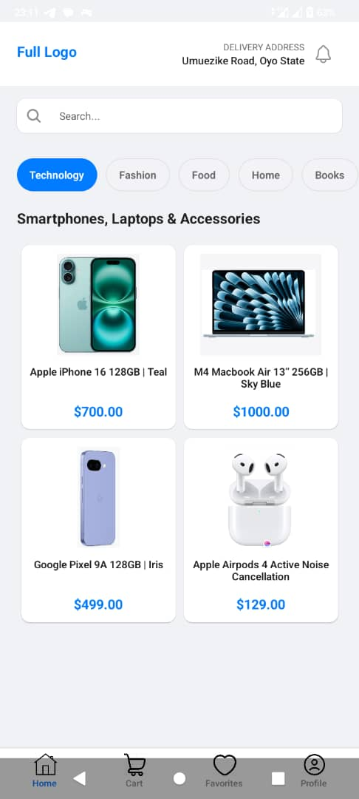
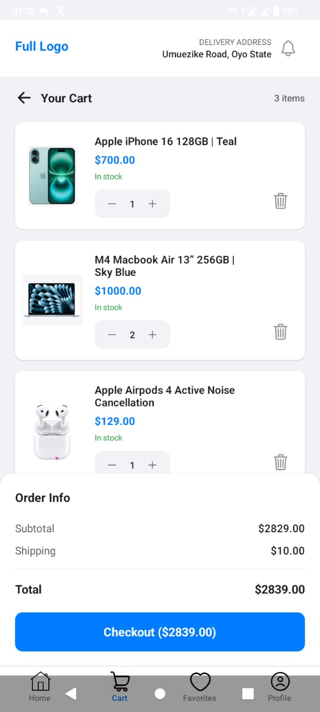

# MiniMart – eCommerce Preview App

## Project Overview

This project is a functional mobile application developed using React Native, meticulously converting a Figma design into a fully interactive e-commerce preview app. The application demonstrates core mobile development skills including faithful UI implementation, efficient navigation, robust state management, and modular component structuring.

## Live Preview

* **Figma Design URL:** [https://www.figma.com/design/ff6kLW7UB7N7JH8P33j39j/Alphatwelve-Mobile-App-Developer-Assessment](https://www.figma.com/design/ff6kLW7UB7N7JH8P33j39j/Alphatwelve-Mobile-App-Developer-Assessment)
* **Android APK Download Link:** https://drive.google.com/file/d/1SkbNSdxBCirdeNCUbwyqsrkNcTLEy2ZA/view?usp=sharing
* **Source Code URL:** https://github.com/sammyovia/minimart-mobile

## Features

The application allows users to:

* **Browse Products:** View a scrollable list/grid of product cards on the Home Page.
* **View Product Details:** Tap on any product to navigate to its detailed view, showing images, name, price, and description.
* **Add to Cart:** Add products from the Product Details screen to the shopping cart.
* **Manage Cart Items:** On the Cart Page, users can view items, adjust quantities, and remove products.
* **Real-time Cart Updates:** The cart icon in the bottom navigation menu displays a counter badge that dynamically updates with the number of items in the cart.
* **Notifications:** A temporary notification (toast) confirms when an item has been successfully added to the cart.
* **Consistent UI:** The entire application adheres faithfully to the provided Figma design, ensuring a pixel-perfect user experience.

## Screens

The application comprises three core screens, mirroring the Figma design:

### 1. Home Page / Product Listing

* Displays a grid of product cards, each featuring the product image, name, and price.
* Includes a prominent top header with a logo, delivery address, and notification icon.
* A search bar is available for product search (functionality implemented for UI, but not actual search logic).
* Tapping on any product card navigates the user to the Product Details screen.
* Product data is loaded from a static array/local JSON source (as per requirements).

### 2. Product Details

* Presents a detailed view of a selected product, including its image, name, price, and comprehensive description.
* Features a "Go back" navigation option.
* An "Add to Cart" button, upon tapping, adds the product to the cart and triggers a success notification/tooltip.

### 3. Cart Page

* Shows all products currently in the shopping cart.
* Each cart item card includes the product image, name, price, quantity controls (plus/minus buttons), and a delete icon.
* Quantity adjustments update the item's quantity in the cart.
* Tapping the delete icon removes the product from the cart.
* Displays a summary of "Subtotal," "Shipping," and the "Total" cost.
* Includes a "Checkout" button displaying the total amount.
* Gracefully handles an empty cart state, prompting the user to "Start Shopping."

## User Flow Summary

The primary user flow is as follows:

**Home Page (Product Listing) → Product Detail → Add to Cart → Toast/Notification → Cart Icon Update**
**Cart Icon → Cart Page**

## Technical Stack

* **Framework:** React Native
* **Language:** TypeScript
* **Navigation:** Expo Router
* **Icon Library:** `@expo/vector-icons` (Ionicons)
* **State Management:** React Context API (`CartContext`)

## Global Styling Strategy

To achieve precise UI accuracy and maintain code quality, the application implements a robust global styling strategy:

* **`constants/Colors.ts`**: Centralized definition of all color variables, ensuring consistent branding and easy theme modifications.
* **`constants/Layout.ts`**: Defines consistent spacing (margins, paddings), border radii, common box shadow styles, and screen dimensions. This promotes uniform visual rhythm and component sizing across the app.
* **`styles/GlobalStyles.ts`**: Contains a single `StyleSheet.create` object with reusable styles for common UI elements such as screen containers, headers, buttons, text variations (headings, body, prices), input fields, and tooltip components. Screens import these global styles and can extend them with `localStyles` for screen-specific adjustments, enhancing modularity and reusability.

This approach directly addresses the "UI Accuracy," "Code Quality," and "Component Reusability and layout structure" evaluation criteria.

## State Management

Cart state is managed efficiently using React's Context API.

* **`CartContext.tsx`**: Provides a central store for `cartItems` and encapsulates all logic for adding, removing, increasing, and decreasing product quantities. This ensures a predictable and maintainable state for the shopping cart across the application.
* **Functional Updates**: State updates within the context (`setCartItems`) utilize the functional update form to prevent stale closure issues and ensure reliable state transitions.
* **`useCart` Hook**: A custom hook simplifies access to the cart's state and actions from any component within the `CartProvider`'s scope, promoting clean and readable code.

## Navigation

* **Expo Router**: Used for declarative and efficient navigation between screens. It ensures smooth transitions and manages the navigation stack effectively, directly addressing the "Navigation" evaluation criterion.

## Code Quality & Component Reusability

* **Modular Structure**: The project is organized into logical directories (e.g., `constants`, `contexts`, `styles`, `types`) to enhance readability and maintainability.
* **Component Reusability**: Common UI patterns (e.g., product cards, cart item display, buttons) are either derived from `GlobalStyles` or extracted into reusable components (like `CartItemComponent` in `CartScreen`) where appropriate, minimizing code duplication and improving consistency.
* **TypeScript**: Utilized throughout the project for strong typing, which improves code reliability, reduces runtime errors, and enhances developer experience.

## Error Handling

* **Context Usage**: The `useCart` hook includes a check to ensure it's used within a `CartProvider`, throwing a clear error if violated, which aids in developer debugging.
* **Empty Cart State**: The `CartScreen` provides a graceful fallback by displaying a user-friendly message and a "Start Shopping" option when the cart is empty, enhancing user experience.

## Installation & Setup Instructions

To set up and run the application locally:

1.  **Clone the repository:**
    ```bash
    git clone https://github.com/sammyovia/minimart-mobile

    Switch to the fixed branch
    
    cd minimart-mobile 
    ```
2.  **Install dependencies:**
    ```bash
    npm install  or yarn install
    ```
3. **Generate a build:**
   See Expo Docs https://docs.expo.dev/build/setup/
   Ensure to delete the current projectId from the app.json file, login to eas and generate a build type.

3.  **Start the Expo development server:**
    ```bash
    npx expo start
    ```
4.  **Run on a device/emulator:**
    * Scan the QR code with the Expo Go app on your phone.
    * Press `a` to run on an Android emulator.
    * Press `i` to run on an iOS simulator.

## Screenshots of Compiled App





=======

